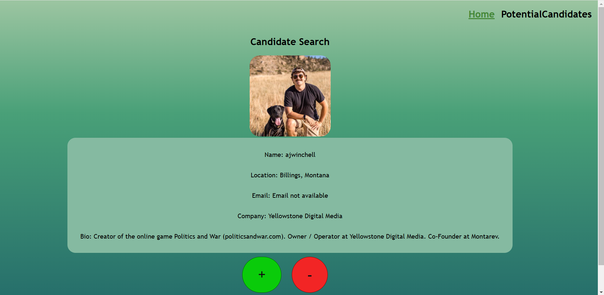
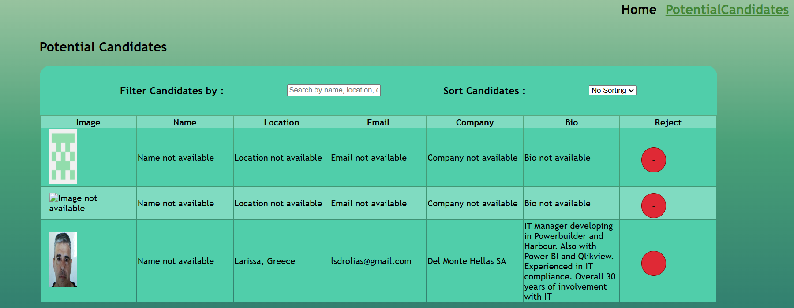

# Candidate Search App
To create a single page application for candidate search Application using React and typescript.
The App first generates a random number between 1 and 100000000 and uses it as the start parameter in the API call which returns a list of Github users, with the username, it then again calls to get the detailed information which being displayed on the screen in the homepage. when the page is loaded with the details of the candidates the user can either accept or reject the candidates. All the accpeted candidates are stored in the local storage and when the user clicks on the Potential candidates tab, the page is loaded with data from the local storage and the user can either sort the candidates or filter by username, location or company. The user will also be able to reject the users by pressing the reject button. When there is null in the data retrived from the Github, we are handling it, and displaying info not available( "email not available".)

## Table of Contents 
- [Candidate Search App](#candidate-search-app)
  - [Table of Contents](#table-of-contents)
  - [Installation](#installation)
  - [Usage](#usage)
  - [Demo](#demo)
  - [ScreenShots](#screenshots)
  - [License](#license)
  - [Questions](#questions)

## Installation
1. Clone the repository:
    git clone git@github.com:gitkaviyarasi/candidategitsearch.git
2. Navigate to the project directory and create a branch and open Code editor.
3. ## Using Vite.
    a. In the command line, navigate to the desired  folder and run `npm create vite`.
    b. Enter the desired name of your new project folder.
    c. From the first list of options, select your framework;  we'll be using `React`.
    d. From the second list of options, select your variant; we'll be using `Typescript`.
    e. `cd` into your newly created project folder and run `npm install`.
4. Setting up the Api Token.
   Generate the Github API token and add it to the .env file for accessing the API.    
   

## Usage
Run `npm dev`/`npm run dev` and navigate to the prompted URL to see your app in dev. 

## Demo
The App is deployed to Render, Click the below link for working application.
https://candidategitsearch.onrender.com/

## ScreenShots
The following image demonstrates the web application's appearance:

## License
MIT

## Questions
If you have any questions about this project, feel free to reach out:

GitHub: gitkaviyarasi 
Email: kaviyarasikrishnannj@gmail.com